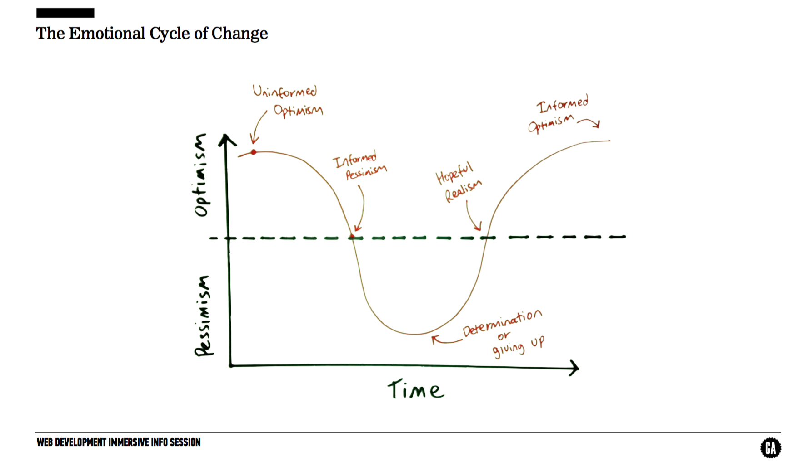

# Big Goal and Class Culture (1 hr 30 min)

## Objectives
* Break the ice and help students feel comfortable interacting with instructors and other students.
* Establish expectations for what students will learn and how they will learn.
* Help students and class as a whole *own* their experience and the classroom *culture*.

## Intro (5-10 min)
**Big Goal**: What we want to accomplish. Each day and lesson should tie into the big goal somehow.

**Culture**: How we're gonna get there.

VSEE ==> Vision / Strategy / Execution / Evaluation

## Big Goal (25-30 min)

What we want to accomplish!

### Examples:

* [The Instructor's Big Goal Example](samples/big-goal-instructors.md)
* [ATL 1 Student's Big Goal and Culture](samples/big-goal-students.md)

> Split up the students and have them write on desks or board about what they want to get out of the class. Then make a Big Goal list.

---

## Class Culture (25-30 min)

Each WDI gets to choose what they want their class culture to be like. Here are some questions to think about and answer:

* How do you want to treat each other?
* How do you want to work together?
* How do you want to be treated by the instructor team?
* How do you want to treat the instructor team?
* What do you want to do about mobiles/facebook?
* What do you want to do if someone misses classes

> Break into groups and discuss what you want your training to be like (10-15 mins)

> Discuss your answers (15mins)

Previous rules for reference can be found [here](samples/culture.md).

## Asking for Help (10 minutes)

What is asking for help?

- This is the thing students find the hardest, and the thing that ultimately determines whether or not students will be successful in this class.
- Without fail, the students who do not ask for help do the poorest in the class.
- Most importantly, **knowing how to ask for help and where to look for answers** is one of the biggest skills you can gain from this class that will be applicable as you prepare to join the professional workforce.

**Turn & Talk**: Everyone should take 30 seconds to think of a time when they've asked someone for help. It doesn't have to be tech-related. Then take 30 seconds to turn and share with your tablemates about those times. What were the outcomes?

We have all asked for help. There's no shame in it. Feeling afraid to ask for help will be one of the biggest detriments in this class.

* What makes asking for help effective?
  - Asking a clear problem:
    * "I don't know any of this" is *not* a clear problem.
    * "I tried this thing and got this error" *is* a clear problem.
  - We will ask you for help when:
      * The question you're asking isn't clear or constructive
      * It's obvious that you haven't made a sufficient effort to find the answer

### How to Ask for Help

1. First, try it yourself
2. Then, Google it
3. Then, ask another student
4. Finally, ask an instructor

## Course Talking Points (20-25 min)

### Course Structure:

* Arc of curriculum, syllabus
  - Unit #1 - Front end Web Development with HTML, CSS, and JavaScript
  - Unit #2 - Back end Web Development with NodeJS, Express, and MongoDB
  - Unit #3 - Modern Web Frameworks - AngularJS and React
  - Unit #4 - Ruby on Rails with a SQL Database
* Other topics in curriculum:
  - Computer Science topics
  - Technical interviewing
  - Package managers and build tools
  - Unit testing
  - Code Linting
  - Lots of misc. libraries and frameworks
* As we mentioned during interviews, schedule will likely change as we adapt to you
* Self-sufficiency / Instructors planning on Wednesday and Friday afternoons
* Lightning Talks
* Squads
* Office Hours - come *prepared* with questions

### Emotional Framing:

* Walkthrough the Emotional Cycle of Change PNG

* This class is going to be hard.
* Pace of class (some think fast, some think slow)
* We must instill confidence
* To *succeed* you must first *fail*
  - Don't be afraid to fail
  - Learning to code is all about *experimentation*

### Other tips to be successful:
* Take your own notes! (We won't be providing them. Also, don't take painstaking notes on syntax!!! Take notes on concepts!!!)
* Show up on time (Or let us know in advance)
* Take care of yourself / sustainability
* It's OK to pivot
* Take advantage office hours
* We're on the same team - we're peers, learn from each other

### Assessments & Grad Requirements
* Show up! (strive for no more than 2 absences)
* Complete your homework (> 80%)
* Quizzes (self assessments)
* Instructor Assessments on Projects 1, 2, and 3.

## Homework
Have the students think about the following framing exercise tonight: [framing exercise](./framing_wdi.md)
